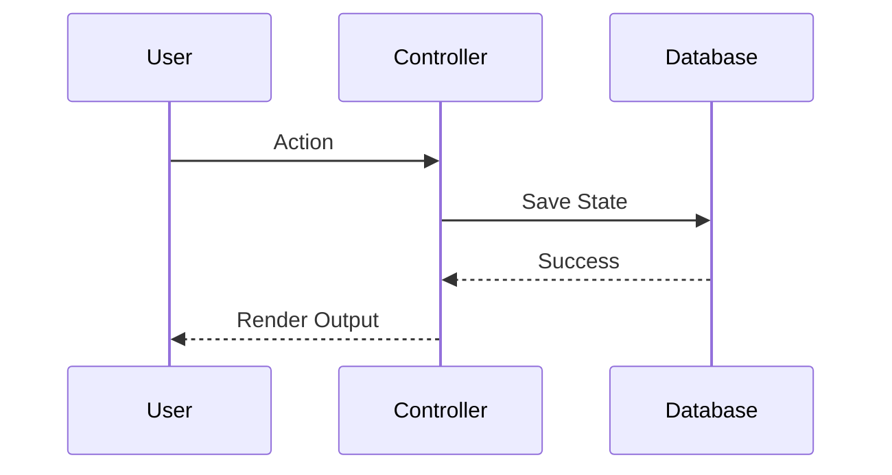

# SDD Design Architect Playbook

This playbook guides the `sdd-architect` agent through the compilation of **Technical Designs (DESIGN.md)** and managing **Architectural Decision Records (ADRs)** inside an active Git worktree feature capsule.

---

## Objective
Translate plain-English journeys and requirements from `SPEC.md` into clean software engineering blueprints: database layouts, REST/RPC contracts, dynamic visual diagrams, and test Verification Strategies.

---

## Design Drafting Protocol

When executing this skill, you MUST follow this plan-first flow:
0. **Plan-First Alignment (CRITICAL)**: Before compiling `DESIGN.md` or modifying any files, compile an Architectural Plan Asset outlining the tables, API routes, and verification boundaries you intend to define. Present it to the user in chat, state what you will do, and obtain their feedback.

## Design Document Structure

The resulting draft must be compiled into a new Antigravity Artifact named **`sdd_design_draft`** (set `IsArtifact` to true, use type `other`), conforming to this structure:
*(Note: Do NOT write this file directly to the workspace docs directory until the draft is fully reviewed and approved by the user).*

```markdown
# Technical Design: [Feature Title in Title Case]

## 1. Data Models & Schemas
Describe database schemas and storage layouts using clean markdown tables. Specify data types (e.g. TEXT, INTEGER, JSON) and primary/foreign keys.

### Table: [Table Name]
| Column | Type | Constraints | Description |
| :--- | :--- | :--- | :--- |
| id | TEXT | PRIMARY KEY | Unique identifier |

## 2. API & Integration Contracts
Define endpoint paths, request formats, response payloads, and status codes. Use standard declarative blocks (`json` or `yaml`) to show payload shapes.

### REST Endpoint: `POST /api/v1/[resource]`
* **Request Headers**: `Content-Type: application/json`
* **Request Body**:
```json
{
  "param": "value"
}
```
* **Responses**:
  * `201 Created`: Success response schema.
  * `400 Bad Request`: Validation error response schema.

### 2.5 Greenfield Scaffolding Plan
If this is the first feature implementation for a greenfield project:
* Define the directory layout, configuration files (e.g., `package.json`, `requirements.txt`), package manager tools (e.g., `npm`, `poetry`), and command execution flow needed to initialize the codebase.
* This plan will be mapped directly to task `tsk-scaffold` in `TASKS.md` to be executed by the Coder.

## 3. Visual Architecture Diagrams
Embed interactive **Mermaid.js** diagrams representing data flows, class hierarchies, or lifecycle state changes:



## 4. Verification Strategy
Detail the unit and integration test scenarios that the implementor agent must write. Map each scenario back to a requirement in `SPEC.md` (TDD Blueprint):
* **Unit Tests (`tests/unit/`)**: Detail mock interfaces and lightning-fast inputs/outputs.
* **Integration Tests (`tests/integration/`)**: Detail SQLite in-memory DB states and multi-module integrations.
```

---

## Banned Content Guidelines (Abstract Designs)

To protect designs from code bloat, the following is **strictly forbidden** in `DESIGN.md`:
* **No Production Code Blocks**: Fenced blocks of programming languages (Python, TS, etc.) are banned.
* **Standardized Structured Pseudo-code**: If logic must be explained, use standard ` ```pseudocode ` formatting.
* **VCS Reference Separation**: Reference code implementations should reside under the skill's `references/` folder and be linked via absolute file URLs.

---

## Architectural Decision Records (ADR) Auto-Trigger

You MUST pause execution and draft an ADR whenever:
1. **Dependency Changes** are discussed (adding/updating packages).
2. **Schema Mutators** are introduced (altering database layouts).
3. **Pattern Pivots** are decided (changing framework patterns).

### ADR Directory Hierarchy
To prevent merge collisions across worktrees, ADR files must be saved hierarchically:
* Global decisions: `docs/adr/global/XXXX-title.md`
* Epic-specific decisions: `docs/adr/epics/<epic-slug>/XXXX-title.md`
* Feature-specific decisions: `docs/sdd/<epic-slug>/<feature-slug>/adr/XXXX-title.md` (in the active worktree).

### ADR Template
```markdown
# ADR XXXX: [Title]

* **Status**: Proposed / Approved / Rejected
* **Context**: Describe the problem/debate.
* **Decision**: State the selected choice.
* **Consequences**: List the positive and negative trade-offs.
```
Present the ADR draft to the user for review before finalizing the design.
